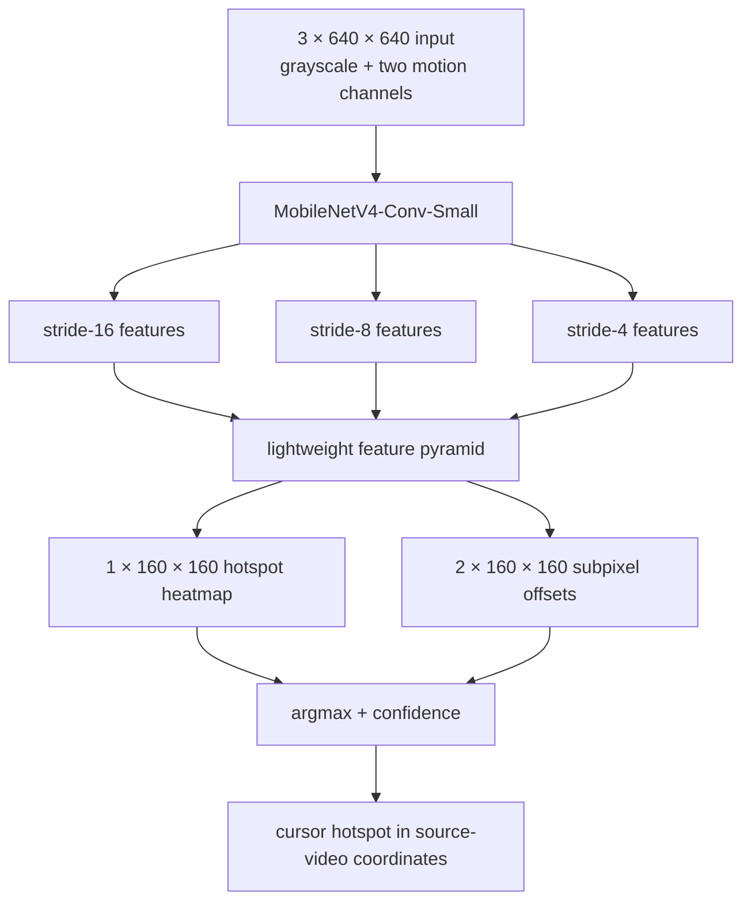

# From Bounding Boxes to Motion: Building a Cursor Detector for Screen Recordings

Finding a mouse cursor in a screen recording sounds like a tiny object-detection problem. We initially treated it as exactly that: take each video frame as an image, run a small YOLO detector, and return the cursor's bounding box.

That approach worked, but not as well as we wanted. The more we investigated, the more we realized that we had framed the problem incorrectly.

A cursor is not merely a small object. It is a small object whose most informative property is often **motion**. And for editing a screen recording, we usually do not care about its bounding box anyway. We care about its **hotspot**: the arrow tip, the center of the pointing finger, or the insertion point of an I-beam.

This article describes how we moved from a static YOLO detector to a temporal MobileNetV4 heatmap model, how we generated the training data without writing millions of frames to disk, and what we learned along the way.

## Why detect cursors after recording?

[ScreenRun](https://screenrun.app/) is a browser-based screen-recording editor. People often import recordings made by another tool rather than recordings captured directly by ScreenRun. In those videos, the cursor has already been burned into the pixels. There is no cursor-event stream and no metadata containing its position.

Recovering the cursor trajectory would enable editing features such as:

- automatic zooms centered on the pointer;
- cursor smoothing;
- click emphasis and motion effects;
- replacing the recorded cursor with a consistent rendered cursor;
- hiding periods of distracting or accidental pointer movement.

The detector therefore needs to run over many video frames, preferably in the browser, without uploading the recording to a server.

## Starting with an existing YOLOv8n detector

Our first baseline was an existing YOLOv8n cursor detector. It could run in the browser after export to ONNX, and ONNX Runtime Web allowed us to use WebGPU with a WASM fallback.

The browser pipeline was conventional:

1. letterbox a video frame to `640×640`;
2. convert it to an ONNX tensor;
3. run YOLOv8n;
4. decode its candidate boxes;
5. apply non-maximum suppression;
6. map the result back into the original video coordinates.

We added a model picker, confidence control, inference timing, FPS reporting, video transport controls, frame stepping, and inference while skimming. This gave us a useful test bench rather than a collection of offline metrics.

The baseline could find many cursors, but its dataset was small: 500 training images, 100 validation images, and 50 test images. The images were screenshot crops, and the cursor distribution did not represent the macOS cursors we cared about—especially the familiar tall I-beam used over text.

## A better synthetic YOLO dataset

The obvious next step was augmentation. We collected clean screenshots and composited macOS cursor sprites over them at runtime.

We restricted the distribution to ordinary pointer families instead of training on every cursor shape we could find:

- arrow: 45%;
- vertical I-beam: 25%;
- pointing hand: 20%;
- grab, grabbing, progress, and resize cursors: 10% combined.

Ninety-eight percent of positive samples used macOS sprites. The remaining two percent used equivalent pointer families from other systems. Five percent of samples contained no cursor.

Cursor size was sampled across three ranges, measured along the sprite's longest dimension in the final `640×640` image:

- 6–12 pixels: 25%;
- 13–24 pixels: 55%;
- 25–40 pixels: 20%.

This covers small cursors in downscaled 1080p recordings, normal cursors, and enlarged accessibility cursors.

### Compositing at runtime

Our first augmentation attempt materialized every generated image. That quickly consumed hundreds of megabytes and made iteration cumbersome. There was no reason to store the composites: the background screenshots and cursor sprites were enough to reproduce them.

We replaced the materialized dataset with a PyTorch dataset that performs composition inside the data loader:

```text
compressed screenshot + cursor sprite + random seed
                         ↓
            crop, resize and composite
                         ↓
        image tensor + generated annotation
```

Training samples change between epochs, while validation samples remain deterministic. The stored source corpus is roughly 100 MB; an arbitrarily large synthetic training corpus exists only while batches are being processed.

We trained a YOLO26n model in two stages:

1. 10 epochs with the backbone frozen;
2. 15 epochs with the full network unfrozen and a lower learning rate.

The default corpus contained 10,000 generated training samples per epoch and 1,000 fixed validation samples.

## Why we moved training to Colab

The training pipeline worked on an Apple M4 through PyTorch MPS, but it was not a good use of time. YOLO26n processed only about seven images per second in our test, putting a full experiment in the multi-hour range.

On a Colab Tesla T4, the same runtime-composited setup was much faster. The final YOLO validation metrics looked excellent:

- precision: 96.8%;
- recall: 91.5%;
- mAP50: 95.2%;
- mAP50–95: 86.2%.

The exported model also ran in our WebGPU test page.

But those numbers were measured on synthetic validation data. When we tested real recordings, the result was still not reliable enough. The network had learned our synthetic distribution very well; that did not mean we had fully captured the real task.

This was the turning point.

## The static-image formulation was the wrong abstraction

Open a random screen-recording frame and try to find its cursor without knowing where it was in the previous frame. On a dense interface, even a human may need a moment. An arrow can resemble an icon edge. An I-beam can disappear into text. A small black pointer can blend into a diagram or terminal.

Now play the same recording. The cursor becomes obvious almost immediately.

YOLO was being asked to solve the harder version of the problem: identify a tiny cursor from appearance alone in every independent frame. The video already contained a strong cue, but we were throwing it away.

This suggested a new input representation using three frames:

```text
R = grayscale(frame t)
G = motion between frame t and frame t−1
B = motion between frame t and frame t−2
```

The grayscale channel preserves enough appearance information to find a stationary cursor. The two difference channels highlight recent motion.

We use a soft absolute threshold rather than a hard binary threshold. Given grayscale values normalized to `[0, 1]`:

```python
def soft_motion(current, previous):
    threshold = 10 / 255
    width = 30 / 255
    return clip((abs(current - previous) - threshold) / width, 0, 1)
```

Differences below 10 intensity levels are suppressed. Larger differences ramp smoothly to one rather than losing their magnitude through binary thresholding.

## From object detection to hotspot detection

Once we started using motion, a second mismatch became clear: we did not actually need object detection.

YOLO predicts boxes. A screen-recording editor needs the cursor hotspot. The center of an arrow's bounding box is not its active point, and the error can be significant relative to such a small object.

The cursor dataset already included normalized hotspot metadata. That let us train directly on the position that matters.

We adopted a CenterNet-style “object as a point” formulation: predict a heatmap whose peak is the hotspot, plus a two-channel offset map to recover subpixel position within the output cell.

## The temporal MobileNetV4 architecture

Our temporal model uses the convolution-only MobileNetV4-Conv-Small backbone. The convolutional variant is attractive for browser deployment because its operators export cleanly to ONNX and are broadly compatible with WebGPU.



Features at strides 4, 8, and 16 are projected to 64 channels. Bilinear upsampling and depthwise-separable convolutions combine them into a `160×160` feature map.

The model has two tiny heads:

- a one-channel heatmap head;
- a two-channel offset head.

At inference time, decoding is simple:

```python
cell_y, cell_x = argmax(heatmap)
dx, dy = offset[:, cell_y, cell_x]

x = (cell_x + dx) * 4
y = (cell_y + dy) * 4
confidence = heatmap[cell_y, cell_x]
```

There are no anchors, candidate boxes, IoU calculations, or non-maximum suppression. The entire model contains approximately 1.29 million parameters. Its ONNX export is about 1.3 MB.

## Generating temporal training samples

The temporal dataset is also generated entirely at runtime. For every sample, we select one screenshot crop, one cursor sprite, one scale, and three correlated positions.

The positions follow a small trajectory rather than being sampled independently:

```python
current = random_position()
velocity = random_velocity()
acceleration = small_random_acceleration()

previous = current - velocity
oldest = previous - velocity + acceleration
```

We composite the same cursor at those three positions, then derive the grayscale and motion channels. The heatmap target is placed at the hotspot in the current frame.

The trajectory distribution includes stationary, slow, medium, and fast movement. Stationary sequences are essential: otherwise the model could learn to depend entirely on the difference channels and fail whenever the user stops moving the mouse.

Perfectly static backgrounds would make the task unrealistically easy, because every changed pixel would belong to the cursor. To prevent that shortcut, some generated sequences include:

- simulated scrolling;
- small changing rectangles resembling animation or text updates;
- mild blur;
- cursor-free negatives.

There is still a domain gap. Real recordings contain video compression, fades, caret blinking, hover effects, embedded video, dropped frames, and arbitrary seeking. Runtime generation simply lets us expand the synthetic distribution as we discover those failures.

## Training the temporal model

We again used Colab with a Tesla T4. The runtime compositor and model processed approximately 25 samples per second, or about seven minutes per 10,000-sample epoch.

We stopped after epoch 11. On the fixed 1,000-sequence synthetic validation set, the best checkpoint achieved:

- precision within 8 pixels: 98.82%;
- recall within 8 pixels: 96.66%;
- predictions within 4 pixels: 94.98%;
- predictions within 8 pixels: 97.28%;
- mean hotspot error: 7.72 pixels.

These metrics are not directly comparable with YOLO mAP. They describe the requirement we actually care about: whether the predicted hotspot is close enough to drive an editor.

As before, synthetic validation is not the final test. But the temporal formulation has two structural advantages that a larger synthetic dataset cannot give the static detector:

1. it consumes the motion cue that makes cursors perceptually salient;
2. it predicts the hotspot directly.

## Running it in the browser

The temporal model exports to ONNX with one input and two outputs:

```text
input   frames   [1, 3, 640, 640]
output  heatmap  [1, 1, 160, 160]
output  offset   [1, 2, 160, 160]
```

The web application keeps the two previously processed grayscale frames in memory. For each new video frame, it constructs the three-channel tensor, runs ONNX Runtime Web, finds the heatmap maximum, applies the offset, and maps the hotspot through the letterbox transform into source-video coordinates.

Our warmed WebGPU test took about 48 ms per frame. The first model initialization is much slower because WebGPU must compile the graph and shaders, but that cost occurs once per session.

The browser demo retains the YOLO models in its picker. This is useful because it lets us compare two different formulations on exactly the same media:

- YOLO: static RGB frame → bounding boxes;
- MobileNetV4: current grayscale and motion → hotspot heatmap.

## What we learned

### Synthetic metrics can answer the wrong question

Our augmented YOLO model scored very well on a held-out synthetic validation set. That proved the training pipeline was internally consistent, but it did not prove the model was ready for arbitrary screen recordings.

### The input representation can matter more than model size

We first tried to improve detection by generating more data and fine-tuning a detector. The larger conceptual gain came from including temporal information already present in the video.

### Predict the output the product needs

A bounding box is a standard computer-vision output, but it was not the natural output for cursor-aware editing. Training directly on hotspot coordinates removed an unnecessary intermediate representation.

### Runtime composition makes experimentation cheap

We can change cursor distributions, scales, trajectories, background motion, and negative rates without creating another large image directory. Storage stays bounded while the effective corpus changes every epoch.

### Real recordings must close the loop

The next major improvement will not come from another synthetic benchmark. It will come from collecting misses and false positives from representative ScreenRun recordings, labeling a modest real validation set, and adding difficult real or reconstructed sequences to training.

## Where we go next

The temporal model is deliberately small and simple. Several extensions are worth exploring:

- evaluate it on a curated set of real recordings from different operating systems, resolutions, frame rates, and codecs;
- add realistic H.264/WebM compression and frame-timing variation to the generator;
- distinguish true cursor motion from scrolling and animated content;
- use confidence and trajectory continuity together instead of thresholding each frame independently;
- add a lightweight Kalman filter or temporal smoother;
- periodically use the static YOLO detector to reacquire the cursor when temporal confidence is low;
- fine-tune on a small number of labeled real sequences;
- benchmark WebGPU performance across browsers and GPUs.

A hybrid system may ultimately be the most robust: the temporal heatmap model runs on every frame, while a static detector or tracker helps recover after cuts, large seeks, or uncertain motion.

## Conclusion

We began with a familiar formulation: cursor detection as tiny-object detection. Better augmentation and more representative macOS cursors improved that baseline, but they also exposed its central limitation. A cursor in a static frame is genuinely difficult to recognize because appearance is only part of the signal.

Video gives us motion for free.

By representing recent motion explicitly and replacing bounding-box detection with hotspot heatmap prediction, we obtained a model that is smaller, more aligned with the product requirement, and easier to decode in the browser.

The broader lesson is not specific to cursors: before scaling a standard vision model, ask whether the model is receiving the information humans actually use—and whether it is predicting the output the application truly needs.

## References

- [MobileNetV4: Universal Models for the Mobile Ecosystem](https://arxiv.org/abs/2404.10518)
- [Objects as Points (CenterNet)](https://arxiv.org/abs/1904.07850)
- [Ultralytics](https://github.com/ultralytics/ultralytics)
- [ONNX Runtime Web](https://onnxruntime.ai/docs/tutorials/web/)
