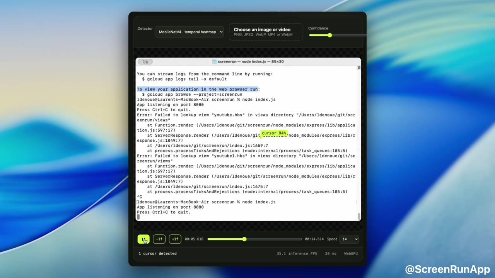

# Cursor Motion Detector

Detect mouse cursor hotspots in screen recordings with temporal motion cues,
MobileNetV4, ONNX Runtime Web, and WebGPU.

**[Read the article and try the live demo](https://ldenoue.github.io/cursor-motion-detector/)**

[](https://ldenoue.github.io/cursor-motion-detector/cursor-motion-detector.mp4)

*[Watch the 33-second result video](https://ldenoue.github.io/cursor-motion-detector/cursor-motion-detector.mp4).*

The repository includes an interactive browser test bench, two static YOLO
baselines, a temporal hotspot model, runtime synthetic-data generators, training
scripts, and Colab notebooks.

> Read **[From Bounding Boxes to Motion](ARTICLE.md)** for the full engineering
> story: why strong synthetic YOLO metrics were not enough, why motion changes
> the problem, and why a hotspot heatmap fits screen-recording editing better
> than bounding boxes.

## The idea

Finding a tiny cursor from one static screenshot is surprisingly difficult—even
for humans. In video, its motion makes it immediately salient. The temporal
model turns three frames into a three-channel tensor:

```text
R = grayscale(frame t)
G = soft-thresholded |frame t − frame t−1|
B = soft-thresholded |frame t − frame t−2|
```

MobileNetV4-Conv-Small converts that tensor into a `160×160` hotspot heatmap and
two subpixel-offset channels. The model predicts the arrow tip, pointing finger,
or text-insertion point directly—no boxes or non-maximum suppression required.

## Browser demo

```bash
npm install
npm run dev
```

Open the displayed local URL and drop in an image or screen recording. Video
transport controls support playback, frame stepping, and inference while
skimming. Processing stays local in the browser.

The model picker compares:

| Model | Input | Output |
| --- | --- | --- |
| Published YOLOv8n | Static RGB frame | Cursor boxes |
| Augmented YOLO26n | Static RGB frame | Cursor boxes |
| Temporal MobileNetV4 | Grayscale + two motion channels | Cursor hotspot |

All three browser-ready models live in `public/models/` and run through ONNX
Runtime Web using WebGPU, with a WASM fallback.

## Temporal model

- MobileNetV4-Conv-Small backbone
- Lightweight stride-4 feature pyramid
- `1.29M` parameters
- Approximately `1.3 MB` ONNX export
- Input: `[1, 3, 640, 640]`
- Heatmap: `[1, 1, 160, 160]`
- Offset map: `[1, 2, 160, 160]`

The best stopped-training checkpoint reached the following results on the fixed
1,000-sequence synthetic validation set:

| Metric | Result |
| --- | ---: |
| Precision within 8 px | 98.82% |
| Recall within 8 px | 96.66% |
| Predictions within 4 px | 94.98% |
| Predictions within 8 px | 97.28% |
| Mean hotspot error | 7.72 px |

These synthetic metrics measure pipeline consistency, not production accuracy.
A representative real-recording benchmark remains essential.

## Runtime-generated training data

Training frames are not materialized to disk. The PyTorch datasets decode a
clean screenshot, crop it to `640×640`, select and scale a cursor sprite, and
composite annotations in worker processes.

The temporal generator creates a coherent three-position trajectory and can add
stationary cursors, scrolling, small animated regions, blur, and cursor-free
sequences. Training samples change each epoch; validation samples are fixed.

Source Parquet assets are intentionally gitignored. Place them under
`training/source/` with these names:

```text
backgrounds-train.parquet
backgrounds-val.parquet
backgrounds-test.parquet
cursors.parquet
```

## Training

### Temporal MobileNetV4

For a local MPS smoke test:

```bash
CURSOR_DEVICE=mps CURSOR_BATCH=16 python training/train_temporal.py
```

CUDA is strongly recommended for a complete run. Create the data/code upload
bundle and open `training/mobilenetv4_temporal_colab.ipynb` in Colab:

```bash
bash training/create_colab_bundle.sh
```

Defaults are 10,000 generated training sequences per epoch, 1,000 fixed
validation sequences, and 20 epochs.

### Augmented YOLO26n baseline

```bash
CURSOR_DEVICE=mps python training/train_augmented.py
```

For CUDA, use `training/yolo_cursor_colab.ipynb`. The two-stage recipe trains 10
frozen-backbone epochs followed by 15 full-network epochs at a lower learning
rate. Its synthetic validation result was `0.952 mAP50` and `0.862 mAP50–95`,
but real recordings motivated the move to temporal hotspot detection.

## Repository layout

```text
ARTICLE.md                         Long-form project write-up
src/                               Browser inference and interface
public/models/                     Browser-ready ONNX models
training/temporal_dataset.py       Runtime temporal sequence generator
training/temporal_model.py         MobileNetV4 heatmap network and losses
training/train_temporal.py         Training, validation and ONNX export
training/runtime_compositor.py     Runtime static YOLO compositor
training/train_augmented.py        Two-stage YOLO26n training
training/*_colab.ipynb             Colab training notebooks
```

## Licensing note

The included YOLO checkpoints originate from or were exported with Ultralytics
and may be subject to AGPL-3.0 terms. Review model, dataset, and dependency
licenses before incorporating these assets into a proprietary product.
